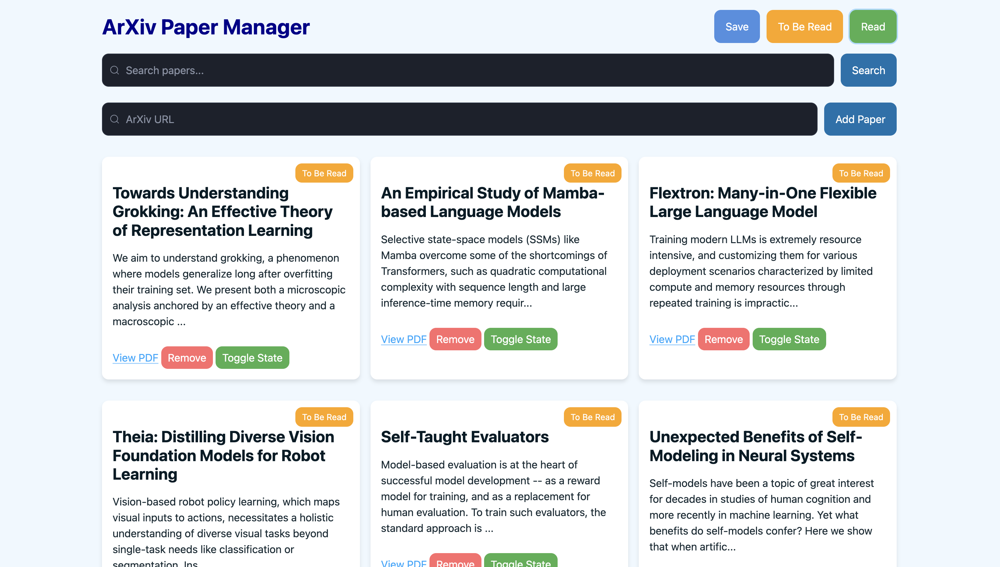

# Arxiv Paper Manager



This is a simple tool to manage arxiv papers, which I needed because I have over 200 papers "To Be Read" that I need to get off my browser tabs on my mobile and laptop. It's made using [FastHTML](https://github.com/AnswerDotAI/fasthtml), which I wanted to give a try. This project is by no means complete, not it is intended to be used for critical purposes. I'm just sharing it in case someone finds it useful (or wants to contribute, which would be awesome).

## Features

- Add papers by arxiv URL (both the paper page URL and the PDF URL are supported)
- Search papers by keyword in the title or abstract
- Mark papers as read
- Delete papers
- Filter papers by read status (the buttons don't work as I wanted them to visually, but functionality is there: click on a button to filter, click again to reset the filter)

## Installation and Usage

1. Clone the repository
2. Install the dependencies:
```bash
make install
```
3. Load data from `arxiv_papers.json` (optional).
```bash
make load_papers
```
4. Run the app:
```bash
make run
```

Very simple. (People should be using Makefiles more often, they're awesome.)

## Contributing

Feel free to open an issue or a pull request. The features I want to add currently are:

- [ ] Make sure the toggled button changes visual state 
- [ ] Better visual elements for errors (currently they are just text slotted into the card layout, which is not very nice)
- [ ] Add a visual confirmation after clicking the save button

## License

This project is licensed under the Apache License 2.0. See the [LICENSE](LICENSE) file for more details.