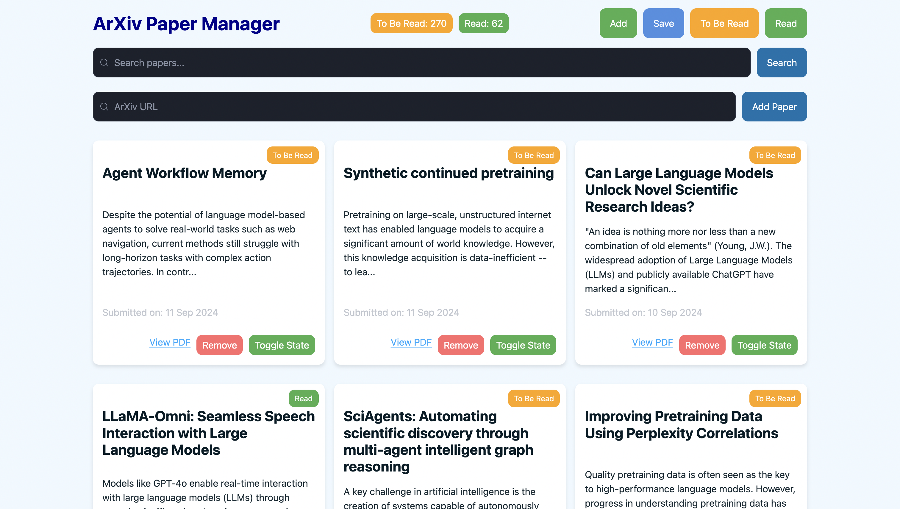
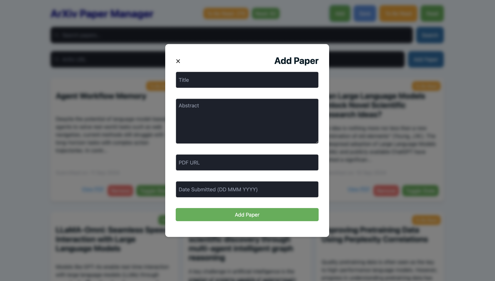

# Arxiv Paper Manager




This is a simple tool to manage arxiv papers, which I needed because I have over 200 papers "To Be Read" that I need to get off my browser tabs on my mobile and laptop. It's made using [FastHTML](https://github.com/AnswerDotAI/fasthtml), which I wanted to give a try. This project is by no means complete, I'm just sharing it in case someone finds it useful (or wants to contribute, which would be awesome).

##### 16/09/2024 Update: 
I'm using this daily, with 372 papers added to the DB. With the new addition of the admin add form, the title is not fully accurate now, but it stays for now. I had to add a [2006 Paper](http://ggp.stanford.edu/readings/uct.pdf), not on arxiv, which is why I've added the admin form.

## Features

- Add papers by arxiv URL (both the paper page URL and the PDF URL are supported)
- Search papers by keyword in the title or abstract
- Mark papers as read
- Delete papers
- Filter papers by read status (the buttons don't work as I wanted them to visually, but functionality is there: click on a button to filter, click again to reset the filter)
- Papers are ordered by submission date, latest first
- Paper counts are displayed in the header
- Add non-arxiv papers by add paper form
- Paper importance levels (Low/Medium/High) to help prioritize reading
- Backwards compatible with existing databases and JSON files

## Installation and Usage

If you're upgrading from a previous version, your existing papers will automatically be assigned "Medium" importance. You can:

1. Keep using your existing database - it will be automatically upgraded
2. Or reset the database and reload from JSON:
```bash
make reset_db
make load_papers
```

To backup your current database before upgrading:
```bash
make backup_db
```

1. Clone the repository
2. Install the dependencies:
```bash
make install
```
3. Load data from `arxiv_papers.json` (optional, if you have saved by using the "Save" button before).
```bash
make load_papers
```
4. Run the app:
```bash
make run
```

Very simple. (People should be using Makefiles more often, they're awesome.)

## Contributing

Feel free to open an issue or a pull request. The features I want to add currently are:

- [ ] Better visual elements for errors (currently they are just text slotted into the card layout, which is not very nice)
- [ ] Add a visual confirmation after clicking the save button

## License

This project is licensed under the Apache License 2.0. See the [LICENSE](LICENSE) file for more details.